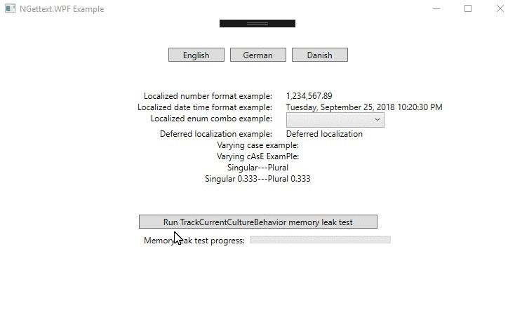

# ngettext-wpf
Proper _internationalization_ (I18N) support for WPF (via [`NGettext`](https://github.com/VitaliiTsilnyk/NGettext)).

Review the <a href="CHANGELOG.md">change history</a>, including what&apos;s new in the latest release and what will be included in the upcomming release.

[//]: <> (TODO: Lookup shields.io badges for nuget package versions, etc.)
[//]: <> (TODO: Could also perhaps automate not only build but also unit tests passing/failing.)

<!-- TODO: we may ping appveyor and leverage it as well but not right now
  [](https://ci.appveyor.com/project/robert-j-engdahl/ngettext-wpf) -->


## Getting Started
[//]: <> (TODO: Needs work, also attention re: CompositionRoot.Compose.)
[//]: <> (TODO: We think NGettext does support 'domains' which is a good thing; need to verify that fact.)
[//]: <> (TODO: Further we think that domain-based contexts should be able to support isolation, containment.)
[//]: <> (TODO: i.e. for use cases, such as per Window/Control, enum values, etc)

Find the [NuGet package](https://www.nuget.org/packages/Ellumination.NGettext.Wpf). You may download the package itself, or add it among your `<PackageReference/>` notations, and so on.

`Ellumination.NGettext.Wpf` is intended to work with dependency injection. Integration occurs via the following entry point from your application:

```c#
NGettext.Wpf.CompositionRoot.Compose("ExampleDomainName");
```

The `"ExampleDomainName"` string is the domain name. This means that, when the current culture is set to `"da-DK"`, localization shall occur from `Locale\da-DK\LC_MESSAGES\ExampleDomainName.mo`, relative to where your WPF application is running. You must include the corresponding [`.mo`](https://file.org/extension/mo) files in your application, ensuring that they are copied to the output directory.

Now you can do something like this in XAML:

```xml
<Button CommandParameter="en-US" 
        Command="{StaticResource ChangeCultureCommand}" 
        Content="{wpf:Gettext English}" />
```

Which demonstrates two features of this library. First, most importantly, is the `Gettext` markup extension, which will make sure the `Content` is set to the localization of "English", with respect to _current culture_, and update it when the _current culture_ has changed. Second, another feature it demonstrates is the `ChangeCultureCommand`, which changes the _current culture_ to the given culture, in this case `"en-US"`.

Have a look at [NGettext.Wpf.Example\UpdateTranslations.ps1](examples/Ellumination.NGettext.Wpf.Example/UpdateLocalization.ps1) for how to extract `MsgId`&apos;s from both `.xaml` and `.cs` files.

Note: The script will initially silently fail (i.e. `2> $null`) because there is no `.po` file for the given language. In the [_gettext world_](https://en.wikipedia.org/wiki/Gettext), one is supposed to create that with the [msginit](https://gnu.org/software/gettext/manual/html_node/Creating.html) command, which ships with the [`Gettext.Tools` NuGet package](https://nuget.org/packages/Gettext.Tools), or [`PoEdit`](https://poedit.net) may be used to initialize the catalog from an intermediate `.pot` file created.

Here is what recently worked for me:

```
PM> mkdir -p Locale\en-GB\LC_MESSAGES\
PM> msginit --input=obj\result.pot --output-file=Locale\en-GB\LC_MESSAGES\ExampleDomainName.po --locale=en_GB
```

---

## Conventions
[//]: <> (Why 'Locale'? <LOCALE>? LC_MESSAGES? I think I see the historical precedent for having done that, but still...)

<!-- TODO: not so much any more, I think there is an opportunity to convey a Stream which may generally locate assets 'anywhere' other than the legacy 'LC_MESSAGES' -->
Keep your compiled localizations in `Locale\<LOCALE>\LC_MESSAGES\<DOMAIN>.mo`. This library will force you to follow this convention. Or rather, NGettext forces you to follow a convention like `"<PATH_TO_LOCALES>\<LOCALE>\LC_MESSAGES\<DOMAIN>.mo"`, and I refined it.

Keep your raw localizations in `Locale\<LOCALE>\LC_MESSAGES\<DOMAIN>.po`. This is not enforced, but when working with `PoEdit`, it will compile the `.mo` file into the correct location when following this convention, and it does not remember your previous choice, so stick with the defaults.

There are lots of GNU conventions related to I18N and _localization_ (L10N). One of them is the notion that the original program is written in US English, so you do not need to translate anything to facilitate I18N. The original text in US English is called the `msgId`.

One of the most important GNU convention related to I18N is providing a context to the translaters so they have a chance to do it right. For instance, the English word 'order' has a number of more or less related meanings and thus may be interpreted differently depending usage. For instance, in the context of sequential ordering, 'order' translates to 'rækkefølge' in `da-DK`, but the imperative for placing an order translates to 'bestil'. Here is an example of how this sort of circumstance may be clarified:

```xml
<!-- A button with the text 'Order' but with a helpful context for the translators -->
<Button Command="{StaticResource PlaceOrderCommand}" 
        Content="{wpf:Gettext Imperative for placing an order|Order}" />
        <!--                  ^^^^^^^^^^^^^^^^^^^^^^^^^^^^^^^ -->
```

Interpreters will rarely think of it, and just translate the first meaning that comes to mind, and as a programmer you might not know which words or sentenses need further context. Therefore, we strongly recommend to always provide a helpful context. At the very least grammatical usage, whether noun or verb, along these lines.

---

## Support

Have a question, want to participate, you get out of it what you contribute:

- By participating in the [project discussions](https://github.com/mwpowellhtx/Ellumination.NGettext.Wpf/discussions)
- By connecting with me on [Github](https://github.com/mwpowellhtx), following my work
- By contacting me on [Gab](https://gab.com/michaelwplde), where you may reach me, primarily
- By following my [Twitter](https://twitter.com/Michael88973702) feed; although I do not use this for contact
- By networking with me via [LinkedIn](https://linkedin.com/in/mwpowellhtx72), always interested in solid business leads
- By [asking a StackOverflow question](https://stackoverflow.com/questions/ask?tags=ngettext.wpf), and by including at least the annotated tags
- Or, by [opening a project issue](https://github.com/mwpowellhtx/Ellumination.NGettext.Wpf/issues)

---

## Sample Application
[//]: <> (TODO: we can stand to think about the example, and breakout out a more 1C proper view model.)
[//]: <> (TODO: contrasted with actual Windows INPC properties, which is kind of counter to the MVVM architecture.)

As presented by [Ellumination.NGettext.Wpf.Example](examples/Ellumination.NGettext.Wpf.Example), you will discover a sample application which illustrates the key features of the packaged dotnet assembly.


